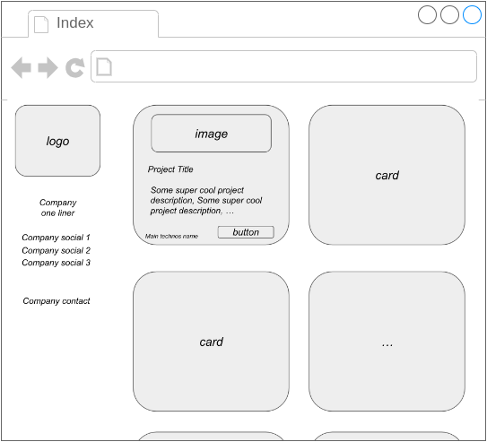
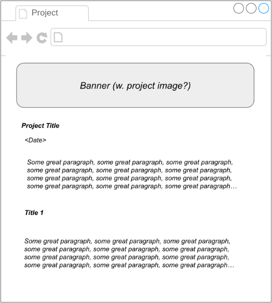
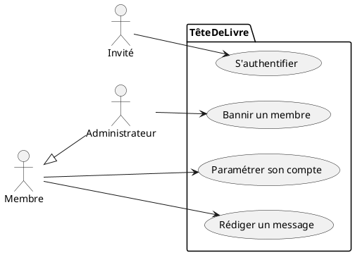
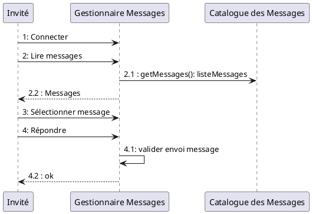

# Challenge O'Vitrine

## 💡 C'est quoi la O'Vitrine ?

La O'Vitrine est une application Web; il s'agit d'un simple site vitrine (un *portfolio*) qu'il va vous falloir réaliser de A à Z.  
Ce challenge consiste en une mise en situation où le concepteur-développeur d'application va devoir réaliser les tâches de conception, puis de développement (front-end et back-end). Pour vous accompagner dans votre mission et atteindre l'objectif, un énoncé vous est proposé chaque jour.  

## Énoncé

Commençons la partie conception d'un projet à partir de votre prise de note et de vos wireframes (maquettes de type "fil de fer") prises lors d'un rendez-vous client. On vous demande de :

* réaliser des diagrammes
  * Cas d'Utilisation (users stories)
  * Séquence
  * Classe
  * Entités-Relations
* faire des maquettes

Les notes que tu as prises sont sûrement un peu light. C'est ta faute 🙈. Prépare une liste de questions pour le client :D

**Notes meeting client**

```
My Planner : le 19 Septembre. 
Titre : Notes 1er RDV client.  
Client : The Marvelous Corporation.

- CEO veut site vitrine pour exposer des projets digitaux (publics, charités, etc. - pas de projets privés/confidentiels !). 
- Projets s'affichent comme une liste de "cartes".
- CTO veut afficher le nom de la techno avec une pastille pour chaque projet. 
- Informations de contact en bas de la page du site. 
- Séparation claire entre la partie métier ("back") et Web UI ("front").
- Pas de connexion, site public vitrine. 
- Click sur un projet -> page de projet, affiche informations spécifiques au projet. 
- Technologies front-end : raw HTML/CSS/JS (pas de framework sauf frameworks front-end de type bootstrap).  
- Logo customisable en haut du site vitrine, avec le nom de l'entreprise en gros. 
```

**Wireframes meeting client**

Page d'accueil :

  

Page de projet :



**Et maintenant ?**

À vous de jouer 🫵 💪

## Rappel UML

### Diagramme de Cas d'Utilisation

L'UML (Unified Modeling Language) est un langage "visuel" ; ce n'est pas une méthodologie.  
Il supporte : 
- la **visualisation** du système,
- l'**aide** à la construction du système,
- la **spécification** de la structure et du comportement du système,
- la **documentation** des décisions.

💡 En ingénierie du bâtiment, on utilise des plans, en ingénierie électrique on utilise des schémas électriques ; en ingénierie logicielle, on utilise l'UML.   

Pour ce challenge, on va vous demander de réaliser des **diagrammes de cas d'utilisation**. Ce type de diagramme **montre ce que fait le système et qui l'utilise**, il est composé de 3 éléments principaux : 
- un **Acteur** (on définit uniquement les acteurs externes physiques et logiques) : il s'agit d'une personne ou d'une entité ("chose") qui va interagir avec le système. On identifie un acteur à l’aide de son nom, qui lui est attribué en fonction du rôle que l’acteur joue par rapport au système. (Ex : invité, utilisateur, etc.). On note toutefois qu’une même personne peut jouer plusieurs rôles, tout comme plusieurs personnes peuvent jouer un même rôle.
- une **Relation entre acteurs** : il n’existe qu’une relation entre acteurs, la généralisation. Un acteur « est un » autre acteur. (Exemple : une personne « est un » être humain).  
- un **Cas d'utilisation** : il s’agit d’un comportement réalisé par le système, il est décrit par une séquence d’actions connectées. Pour nommer un cas d’utilisation, on se place du point de vue de l’acteur qui déclenche celui-ci. On utilise un verbe à l’infinitif et, si besoin, une simple combinaison verbe-nom. Ce nom doit être unique, intuitif et auto-explicatif. (Exemple : s'authentifier, paramétrer son compte, etc.).

Un diagramme de cas d'utilisation permet de définir le système du point de vue des ~~développeurs~~ **utilisateurs**.  
Il permet donc de structurer les besoins (cahier des charges), mais aussi le reste du développement.  

Vous retrouverez un exemple de diagramme de cas d'utilisation ci-dessous : 



Pour réaliser vos diagrammes UML, on vous recommande d'utiliser [PlantUML](https://plantuml.com/), que vous pouvez [télécharger ici](https://plantuml.com/download). Il existe également une [extension VSCode](https://marketplace.visualstudio.com/items?itemName=jebbs.plantuml). 

Vous retrouverez la section de la [documentation de PlantUML dédiée aux diagrammes de cas d'utilisation ici.](https://plantuml.com/use-case-diagram).

Cela vous permettra donc de mettre vos fichiers PlantUML (diagrammes) dans un repo Git ! 

### Diagramme de Séquence

Un diagramme de séquence montre les flots de communications. Il s'agit d'une vue temporelle de l'interaction entre objets. Là où le cas d'utilisation présente une vue externe du système, le diagramme de séquence, lui, montre comment des objets peuvent collaborer pour réaliser les cas d'utilisation. 

Le but **d'un** diagramme de séquence est de préciser le contenu **d'un** cas d'utilisation en décrivant les scénarii possibles (aussi appelés flots d'évènements). En pratique, on ne décrit que les scénarii les plus représentatifs.  




**Rappel :** pour réaliser vos diagrammes UML, on vous recommande d'utiliser [PlantUML](https://plantuml.com/), que vous pouvez [télécharger ici](https://plantuml.com/download). Il existe également une [extension VSCode](https://marketplace.visualstudio.com/items?itemName=jebbs.plantuml). 

Cela vous permettra donc de mettre vos fichiers PlantUML (diagrammes) dans un repo Git !

Enfin, vous retrouverez la section de la [documentation de PlantUML dédiée aux diagrammes de séquence ici.](https://plantuml.com/sequence-diagram).

### Diagramme de Classe

Le diagramme de classe permet de visualiser le *domaine* (ou *"partie métier"*). Il permet de déterminer et représenter les concepts, ainsi que les relations entre concepts. A titre de rappel, on y représente : 
- Les classes : nom de la classe, les attributs (hors getters/setters), et les opérations
- Les relations entre classes : 
  - Une **association** (notée `-->` en PlantUML) fournit un chemin de communication entre objets. Elles peuvent avoir ou non des étiquettes, des noms de rôle ou encore une multiplicité (aussi appelé cardinalité). Elles peuvent également indiquer la « navigation » à travers le sens de la flèche. Dans le cas où aucune flèche n’est représentée, l’association est dite bidirectionnelle.
  - Une **généralisation/spécialisation** (notée `<|--` en PlantUML) représente la relation entre une super-classe et ses sous-classes. Les éléments communs (attributes, comportements, relations) sont reportés au niveau le plus haut de la hiérarchie.

On laisse de côté les concepts de classe abstraite, ainsi que les relations de composition et d'agrégation pour le moment.  

**Rappel :** pour réaliser vos diagrammes UML, on vous recommande d'utiliser [PlantUML](https://plantuml.com/), que vous pouvez [télécharger ici](https://plantuml.com/download). Il existe également une [extension VSCode](https://marketplace.visualstudio.com/items?itemName=jebbs.plantuml). 

Aussi, vous retrouverez la section de la [documentation de PlantUML dédiée aux diagrammes de classe ici.](https://plantuml.com/class-diagram).

### Diagramme Entités-Relations 
