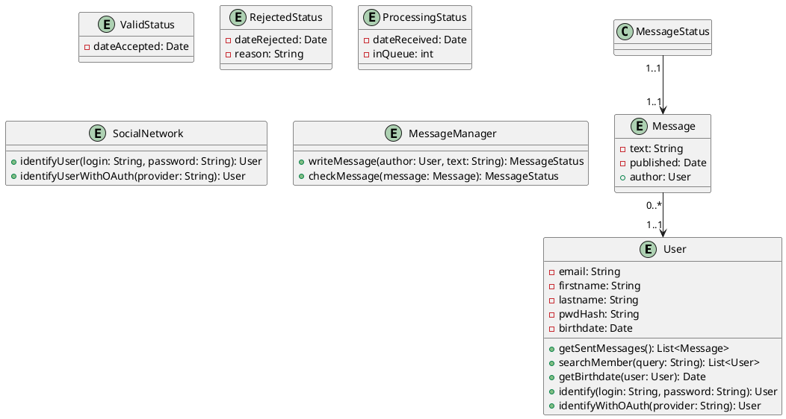

# Demo PlantUML via fichier Markdown

```plantuml 
@startuml

Entity User {
    - email: String 
    - firstname: String
    - lastname: String
    - pwdHash: String
    - birthdate: Date
    + getSentMessages(): List<Message>
    + searchMember(query: String): List<User>
    + getBirthdate(user: User): Date
    + identify(login: String, password: String): User
    + identifyWithOAuth(provider: String): User
}

Entity Message {
    - text: String
    - published: Date
    + author: User
}

Entity ValidStatus { 
    - dateAccepted: Date
}

Entity RejectedStatus {
    - dateRejected: Date
    - reason: String
}

Entity ProcessingStatus {
    - dateReceived: Date
    - inQueue: int
}

Entity SocialNetwork {
    + identifyUser(login: String, password: String): User
    + identifyUserWithOAuth(provider: String): User
}

Entity MessageManager {
    + writeMessage(author: User, text: String): MessageStatus
    + checkMessage(message: Message): MessageStatus
}
Message "0..*" --> "1..1" User
MessageStatus "1..1" --> "1..1" Message 

@enduml
``` 
